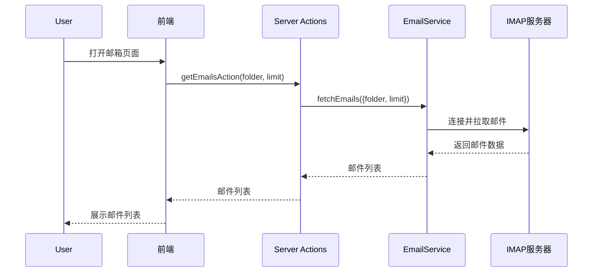
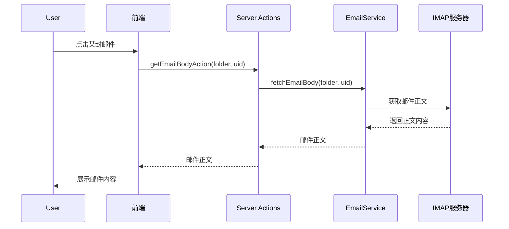
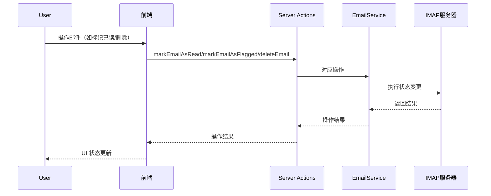

# Email 功能技术文档

## 一、功能概述

本模块实现了企业级邮箱的收件、查看、标记、删除等基础功能，支持多文件夹（如 INBOX、已发送、草稿等）邮件的读取与管理。系统通过 IMAP 协议与邮件服务器交互，支持邮件缓存与状态同步，提升用户体验。

## 二、核心功能

1. **邮件列表获取**
   - 支持按文件夹（如 INBOX）分页拉取邮件列表，默认显示最新邮件。
   - 支持获取指定 UID 之后的新邮件，实现增量同步。

2. **邮件详情查看**
   - 可查看邮件正文（支持 HTML 与纯文本）、发件人、收件人、抄送、时间、附件等详细信息。

3. **邮件状态管理**
   - 支持标记邮件为已读/未读。
   - 支持标记/取消标记邮件为"星标"。
   - 支持删除邮件（移动到已删除文件夹或彻底删除）。

4. **文件夹管理**
   - 支持获取所有邮箱文件夹列表，便于用户切换不同文件夹查看邮件。

5. **本地缓存**
   - 邮件拉取后会缓存到本地数据库，提升二次访问速度，并支持离线查看部分内容。
   - 支持缓存邮件正文、元数据、状态等。

## 三、业务流程

### 1. 邮件拉取流程



### 2. 邮件详情查看流程



### 3. 邮件状态变更（已读/未读、星标、删除）



## 四、主要技术点

- **IMAP 协议**：通过 `node-imap` 实现与邮件服务器的通信。
- **邮件解析**：使用 `mailparser` 解析邮件内容，提取正文、附件等。
- **服务端缓存**：通过本地数据库缓存邮件，减少重复拉取。
- **服务端 Actions**：所有操作均通过服务端 actions 封装，保证安全与一致性。
- **组件化前端**：邮件列表、详情、操作等均为独立组件，便于维护和扩展。

## 五、接口说明（部分）

- `getEmailsAction(folder, limit)`：获取指定文件夹下的邮件列表。
- `getEmailBodyAction(folder, uid)`：获取指定邮件的正文内容。
- `markEmailAsRead(uid)` / `markEmailAsUnread(uid)`：标记邮件已读/未读。
- `markEmailAsFlagged(uid)`：标记/取消星标。
- `deleteEmail(uid)`：删除邮件。

## 六、数据格式说明

### 1. 邮件数据结构

从服务器拉取的每封邮件，数据结构如下（`EmailMessage`）：

```ts
{
  id: string,                // 唯一ID（通常为 messageId 或 uid 生成）
  uid: number,               // 邮件在IMAP中的唯一标识
  subject: string,           // 邮件主题
  from: { name: string, address: string }, // 发件人
  to: Array<{ name: string, address: string }>, // 收件人
  cc?: Array<{ name: string, address: string }>, // 抄送
  bcc?: Array<{ name: string, address: string }>, // 密送
  date: Date,                // 发送时间
  text?: string,             // 纯文本正文
  html?: string,             // HTML正文
  attachments: Array<{
    filename: string,
    contentType: string,
    size: number
  }>,                        // 附件列表
  flags: string[],           // IMAP原始标记
  isRead: boolean,           // 是否已读
  isFlagged: boolean,        // 是否星标
  isAnswered: boolean,       // 是否已回复
  isDeleted: boolean         // 是否已删除
}
```

### 2. 邮件列表接口返回格式

如 `getEmailsAction`、`getEmails` 等接口，返回格式通常如下：

```ts
{
  success: true,
  data: {
    emails: EmailMessage[], // 邮件数组
    total: number           // 邮件总数
  }
}
```
失败时：
```ts
{
  success: false,
  error: string,            // 错误信息
  data: {
    emails: [],
    total: 0
  }
}
```

### 3. 邮件正文接口返回格式

如 `getEmailBodyAction`：

```ts
{
  text?: string,            // 纯文本正文
  html?: string             // HTML正文
}
```

### 4. 邮件本地缓存格式

缓存时会将 `date` 字段转为 ISO 字符串，并增加如下字段：

```ts
{
  ...EmailMessage,
  date: string,             // ISO 格式字符串
  cachedAt: string,         // 缓存时间
  folder: string,           // 所属文件夹
  bodyLoaded: boolean       // 是否已缓存正文
}
```

### 5. 数据处理流程

- **拉取邮件**：服务端从 IMAP 拉取原始邮件，解析为 `EmailMessage` 结构，返回给前端。
- **本地缓存**：前端/服务端将邮件数据缓存到本地数据库，便于快速访问和离线支持。
- **展示处理**：前端组件根据 `EmailMessage` 结构渲染邮件列表和详情，支持多种状态（已读、星标等）和附件展示。
- **状态同步**：对邮件的已读、星标、删除等操作会同步更新本地缓存和服务器状态，保证一致性。

---

如需更详细的接口参数、数据结构或前端组件说明，可进一步补充。
