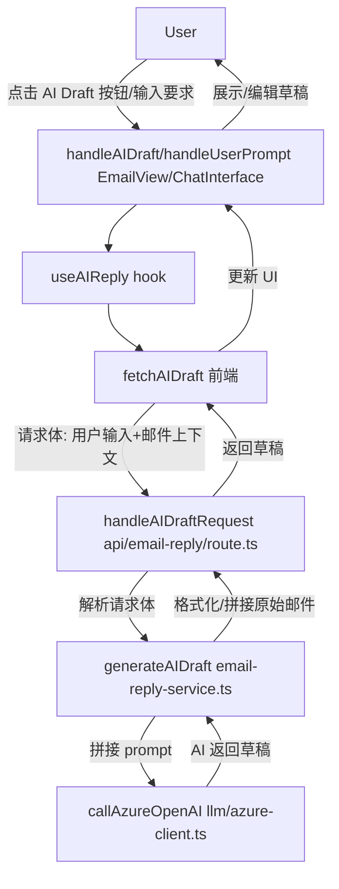

```mermaid
flowchart TD
    A[User] -->|点击 AI Draft 按钮/输入要求| B[handleAIDraft/handleUserPrompt EmailView/ChatInterface]
    B --> C[useAIReply hook]
    C --> D[fetchAIDraft 前端]
    D -->|请求体: 用户输入+邮件上下文| E[handleAIDraftRequest api/email-reply/route.ts]
    E -->|解析请求体| F[generateAIDraft email-reply-service.ts]
    F -->|拼接 prompt| G[callAzureOpenAI llm/azure-client.ts]
    G -->|AI 返回草稿| F
    F -->|格式化/拼接原始邮件| E
    E -->|返回草稿| D
    D -->|更新 UI| B
    B -->|展示/编辑草稿| A
```