# 邮件系统流程文档

## 1. 渐进式加载策略 ✨（新增）

### 1.1 核心设计思路
- **快速响应**：优先加载前20封邮件，1-2秒内显示给用户
- **后台加载**：无感知继续加载到200封邮件
- **按需扩展**：用户下拉时才加载更多邮件
- **连接监控**：检测IMAP连接状态，断开时引导重新登录

### 1.2 渐进式加载流程

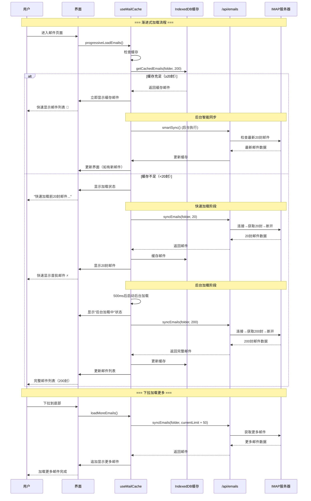

### 1.3 连接状态监控

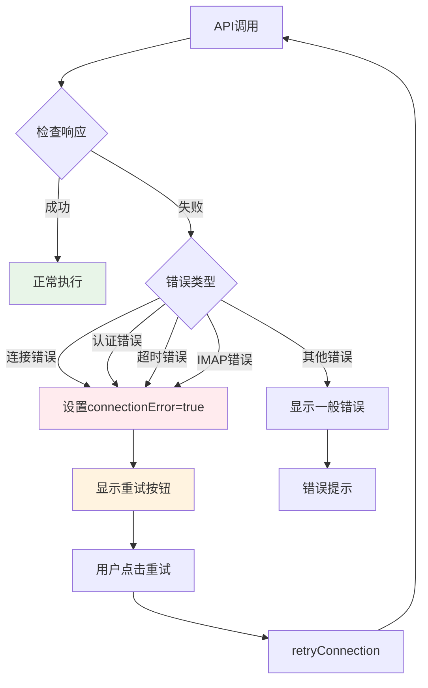

### 1.4 性能优化特点

| 特性 | 传统加载 | ✨ 渐进式加载 |
|------|----------|-------------|
| **首屏显示时间** | 3-5秒 | **1-2秒** |
| **用户感知** | 长时间等待 | **立即响应** |
| **后台加载** | 无 | **无感知继续加载** |
| **错误恢复** | 重新加载全部 | **智能重试机制** |
| **缓存策略** | 简单缓存 | **智能缓存+增量更新** |
| **网络流量** | 一次性大量 | **分批次加载** |

## 2. 用户登录流程

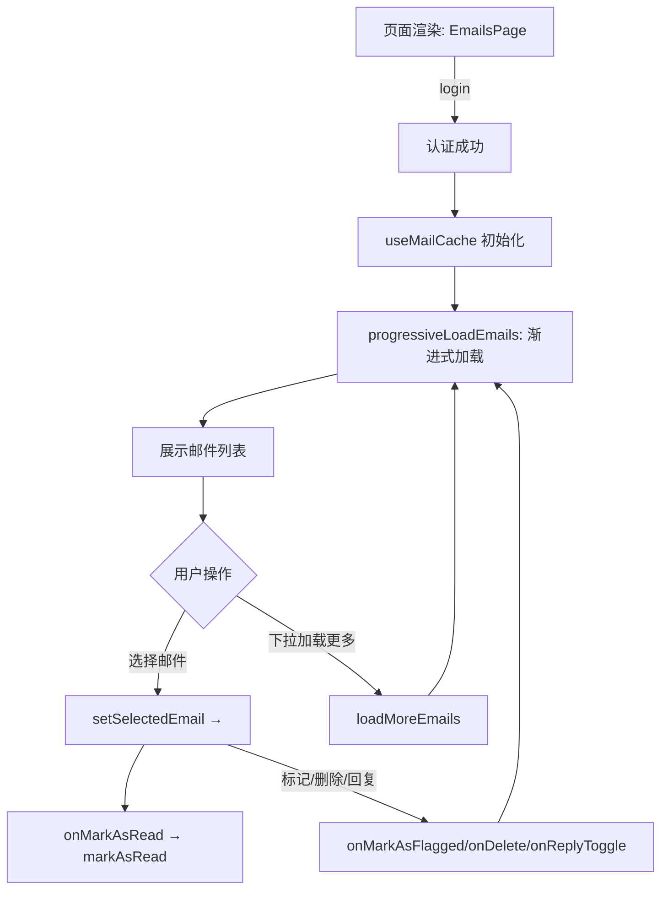

## 1. 用户处理登录，没有 cache 数据

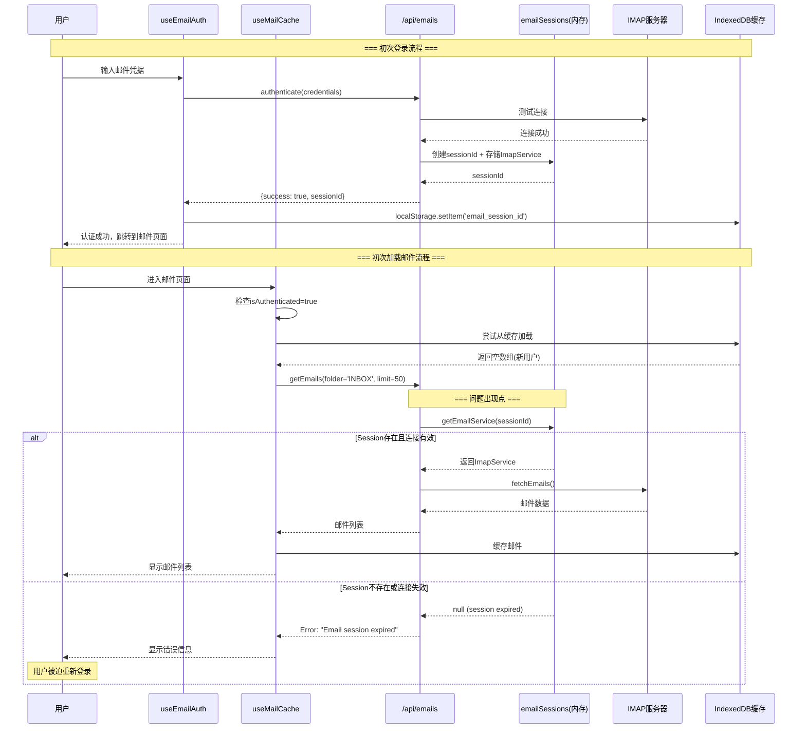

## 1.1 问题根因分析

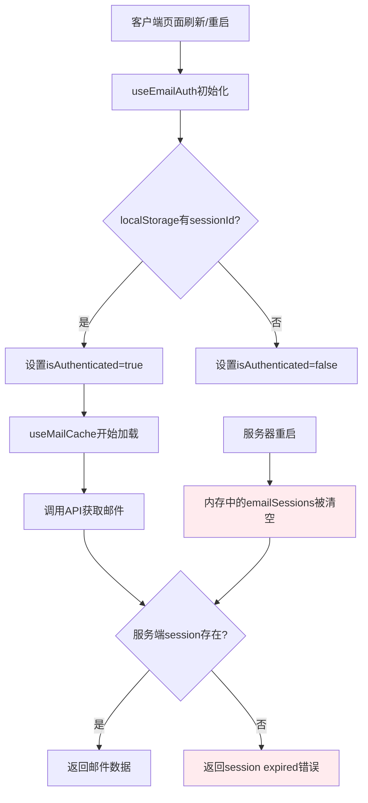

## 1.2 修复后的流程 - 带session验证

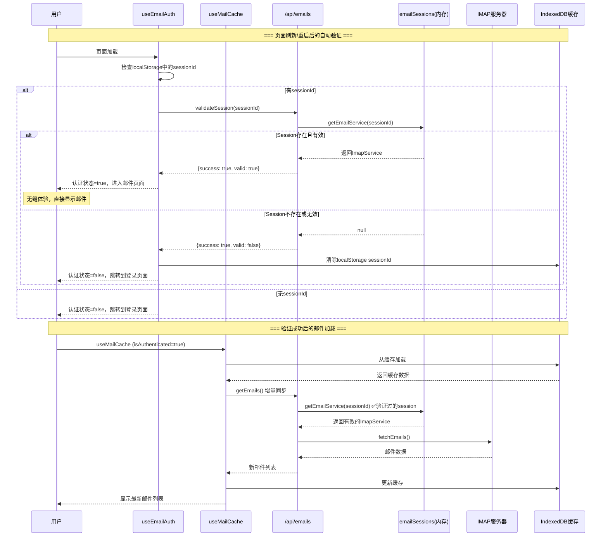

## 2. ✅ 简化后的「按需连接」策略

### 2.1 核心设计思路

- **一次性连接**：每次操作都是 连接 → 执行 → 断开
- **无Session管理**：不在内存中保持连接状态
- **简单可靠**：避免复杂的重连和session过期问题
- **本地缓存**：使用IndexedDB缓存邮件，减少重复请求

### 2.2 简化后的认证和同步流程

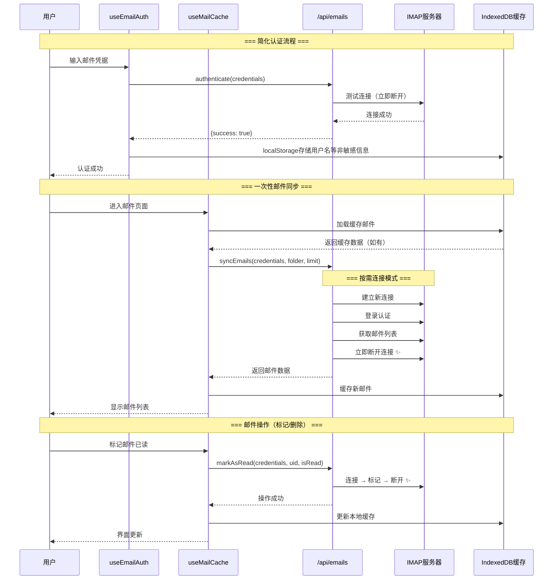

### 2.3 关键优势对比

| 特性 | 之前的Session模式 | ✅ 简化后的按需连接 |
|------|------------------|-------------------|
| **连接管理** | 复杂的session生命周期 | 每次操作独立连接 |
| **内存占用** | 需要维护连接池 | 无持久连接 |
| **错误处理** | session过期、重连逻辑 | 简单的连接失败重试 |
| **可靠性** | 受服务器重启影响 | 每次都是新连接，更稳定 |
| **实现复杂度** | 高（需要管理状态） | 低（无状态设计） |
| **安全性** | 需要管理session安全 | 每次验证，更安全 |

### 2.4 API设计变化

#### 之前（Session模式）
```typescript
// 需要先认证获取sessionId
const {sessionId} = await authenticate(credentials);

// 后续操作需要传递sessionId
await getEmails(sessionId, folder, limit);
await markAsRead(sessionId, uid, isRead);
```

#### ✅ 现在（按需连接）
```typescript
// 每次操作都传递完整credentials
await syncEmails(credentials, folder, limit);
await markAsRead(credentials, uid, isRead);
```

### 2.5 性能考虑

**连接开销**：
- IMAP连接建立时间：~200-500ms
- 对于低频操作（用户手动刷新），开销可接受
- 本地缓存减少不必要的网络请求

**适用场景**：
- ✅ 适合：个人邮件管理，低并发场景
- ❌ 不适合：高频实时同步，大量并发用户

## 3. IMAP Session 处理机制详解（已废弃）

### 2.1 Session 生命周期管理

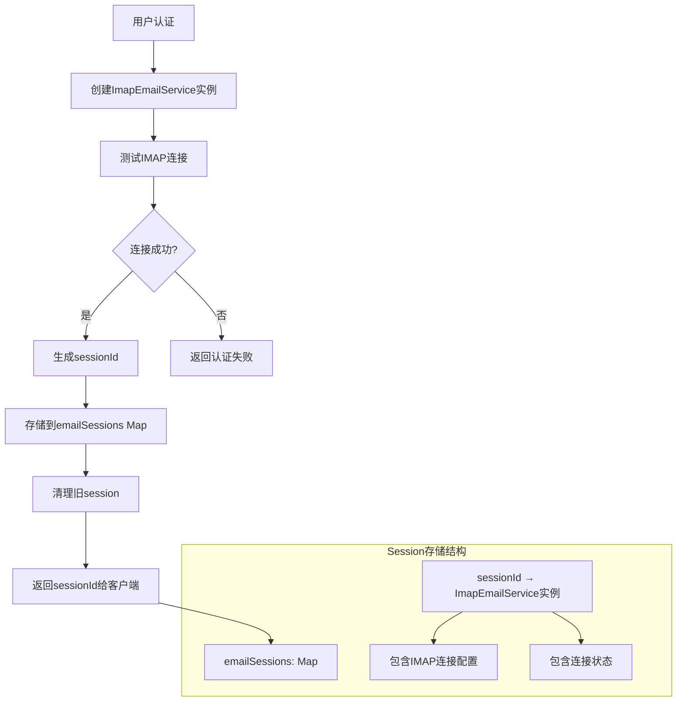

### 2.2 IMAP 连接配置和特性

| 配置项 | 值 | 说明 |
|--------|-----|------|
| `keepalive` | `false` | **不保持连接** - 连接会在空闲时断开 |
| `authTimeout` | `10000ms` | 认证超时时间 |
| `connTimeout` | `15000ms` | 连接超时时间 |
| `tlsOptions` | `{rejectUnauthorized: false}` | TLS配置，允许自签名证书 |

### 2.3 连接状态检查和重连机制

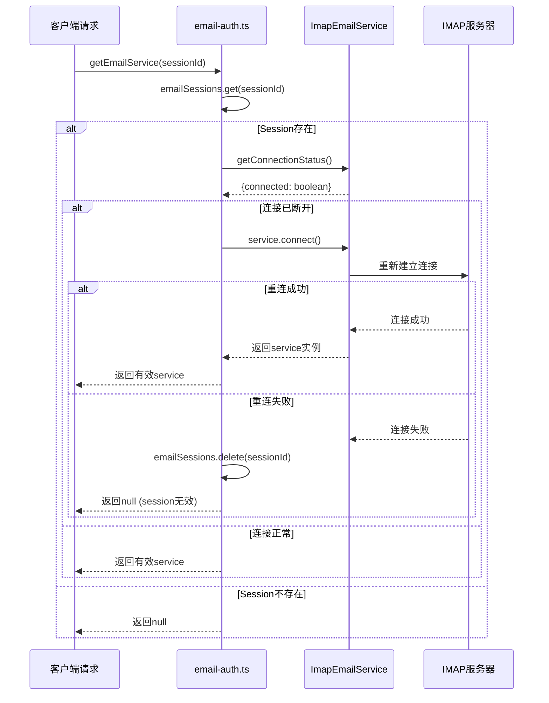

### 2.4 Session 清理策略

```typescript
function cleanupOldSessions(): void {
  // 简单的清理策略：当session数量超过10个时
  if (emailSessions.size > 10) {
    // 删除前5个session (FIFO策略)
    const sessionsToRemove = Array.from(emailSessions.keys()).slice(0, 5);
    for (const sessionId of sessionsToRemove) {
      const service = emailSessions.get(sessionId);
      if (service) {
        service.disconnect().catch(console.error);
        emailSessions.delete(sessionId);
      }
    }
  }
}
```

### 2.5 关键问题和限制

#### ❌ 当前存在的问题：

1. **内存存储** - `emailSessions` 存储在内存中，服务器重启后丢失
2. **无时间戳跟踪** - 无法按实际时间清理过期session
3. **keepalive=false** - IMAP连接不保持活跃，空闲时断开
4. **简单清理策略** - 只按数量清理，不按时间或使用频率

#### ⚠️ 连接行为特点：

- IMAP连接是**按需重连**的短连接模式
- 每次API调用会检查连接状态，断开时自动重连
- 连接失败的session会被立即清理
- 多个用户session可能同时存在

### 2.6 实际运行流程

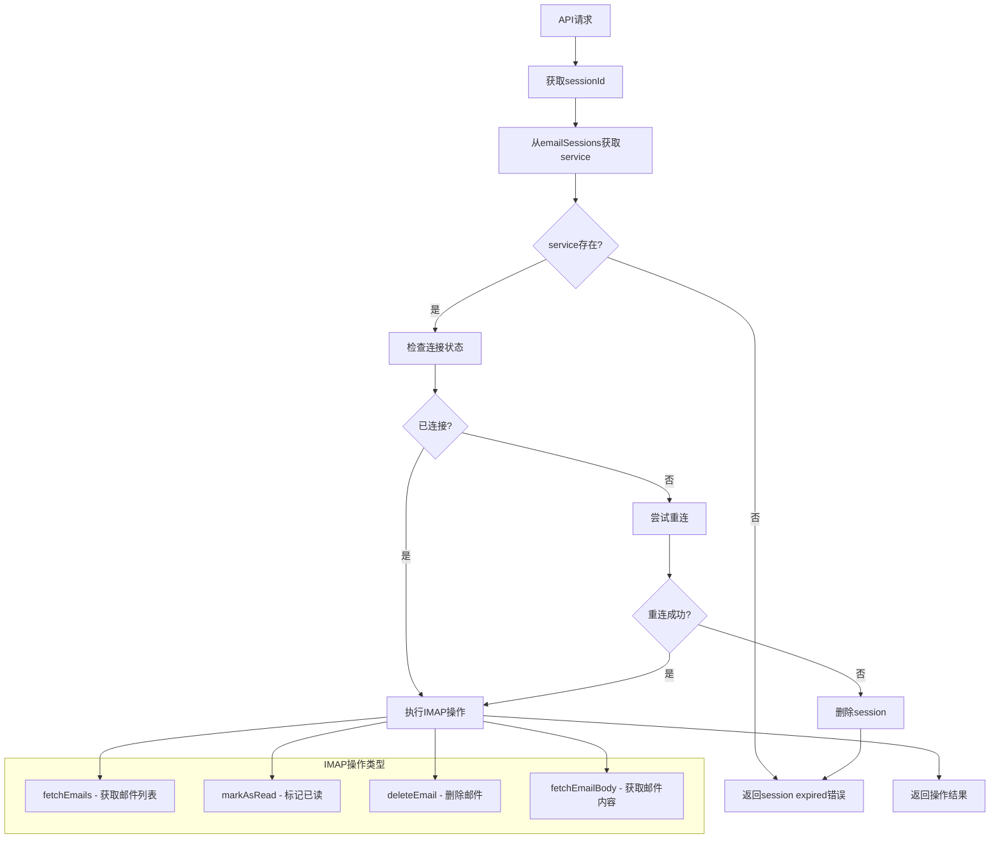


# Sequence Diagram
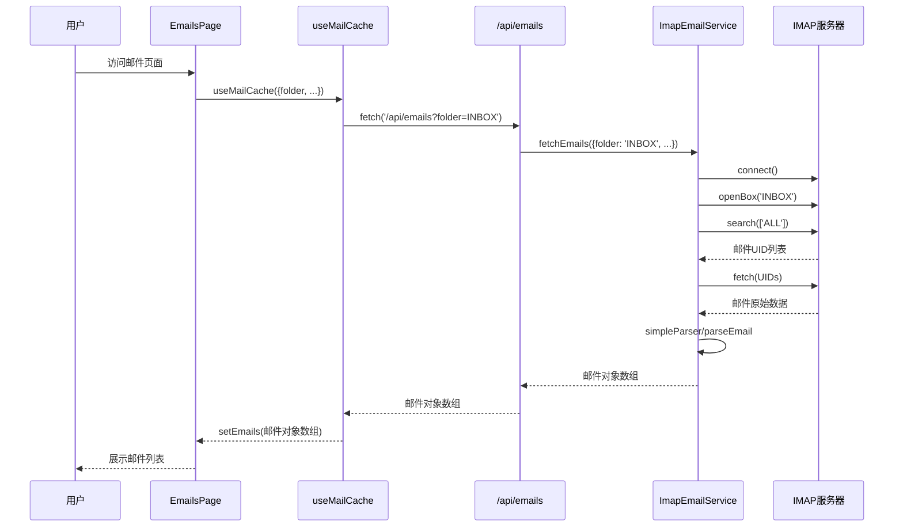


# node-imap 收件 邮件数据格式
IMAP fetch 拉回的是原始邮件（RFC822 格式），内容是纯文本（包括头部、正文、附件等）。
mailparser/simpleParser 解析后，得到结构化的 ParsedMail 对象，常用字段有：
subject：主题
from、to、cc、bcc：发件人、收件人
date：时间
text：纯文本正文
html：HTML 正文
attachments：附件数组


# nodemailer 发件流程概述
nodemailer 是 Node.js 下最流行的邮件发送库，主要用于通过 SMTP 协议发送邮件。
在你的 ImapEmailService 里，发件流程大致如下：
步骤一：初始化 SMTP 连接
创建 nodemailer.createTransport 实例，配置 SMTP 服务器地址、端口、用户名、密码、加密方式（SSL/TLS）。
这个 transporter 实例会和 SMTP 服务器建立连接（通常是短连接，发完邮件即断开）。


| Protocol | Server Name | Port | Encryption Method |
| --- | --- | --- | --- |
| POP | mail.rwth-aachen.de | 995 | SSL |
| IMAP | mail.rwth-aachen.de | 993 | SSL |
| SMTP | mail.rwth-aachen.de | 587 | TLS |