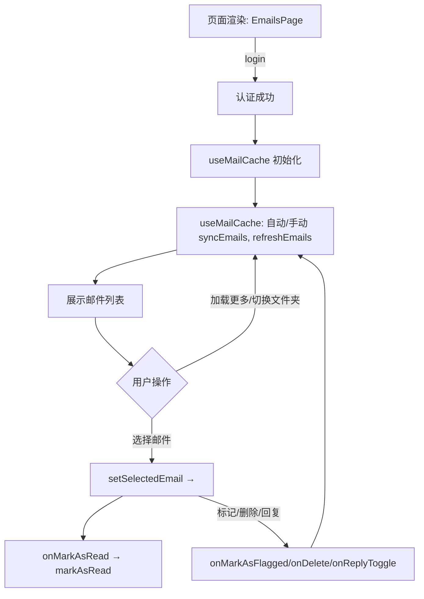
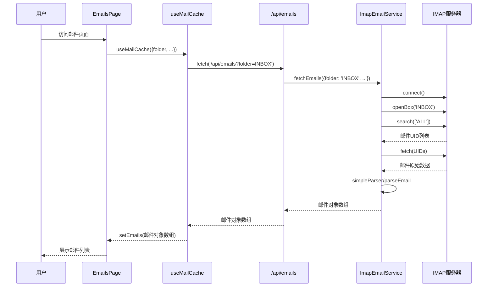

# Flowchart

# Sequence Diagram

# node-imap 收件 邮件数据格式
IMAP fetch 拉回的是原始邮件（RFC822 格式），内容是纯文本（包括头部、正文、附件等）。
mailparser/simpleParser 解析后，得到结构化的 ParsedMail 对象，常用字段有：
subject：主题
from、to、cc、bcc：发件人、收件人
date：时间
text：纯文本正文
html：HTML 正文
attachments：附件数组

# nodemailer 发件流程概述
nodemailer 是 Node.js 下最流行的邮件发送库，主要用于通过 SMTP 协议发送邮件。
在你的 ImapEmailService 里，发件流程大致如下：
步骤一：初始化 SMTP 连接
创建 nodemailer.createTransport 实例，配置 SMTP 服务器地址、端口、用户名、密码、加密方式（SSL/TLS）。
这个 transporter 实例会和 SMTP 服务器建立连接（通常是短连接，发完邮件即断开）。

| Protocol | Server Name | Port | Encryption Method |
| --- | --- | --- | --- |
| POP | mail.rwth-aachen.de | 995 | SSL |
| IMAP | mail.rwth-aachen.de | 993 | SSL |
| SMTP | mail.rwth-aachen.de | 587 | TLS |