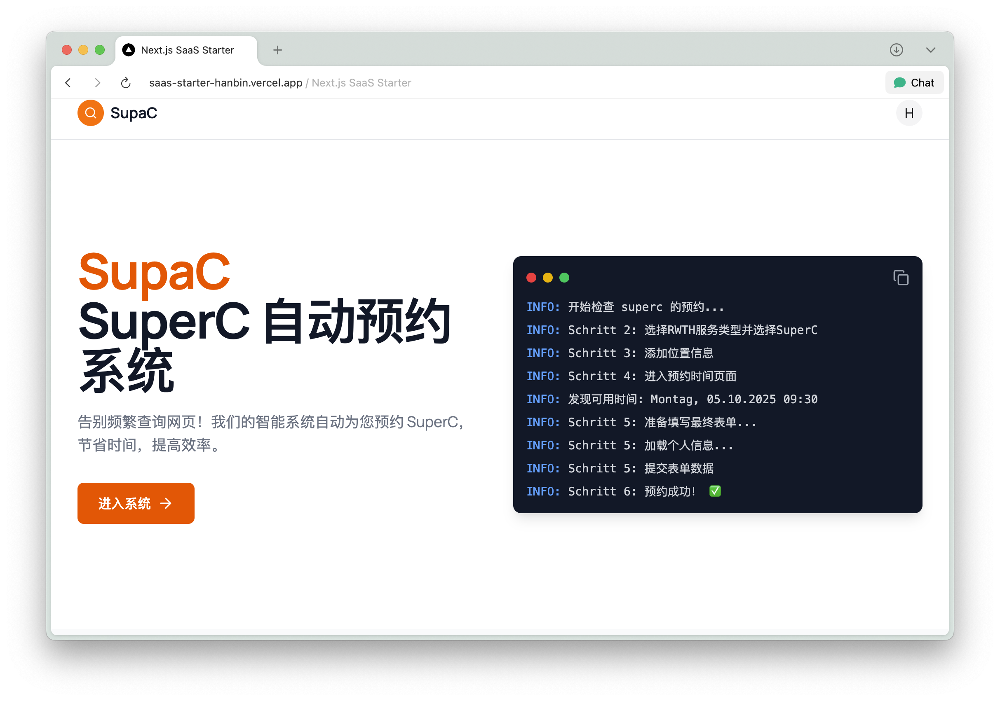
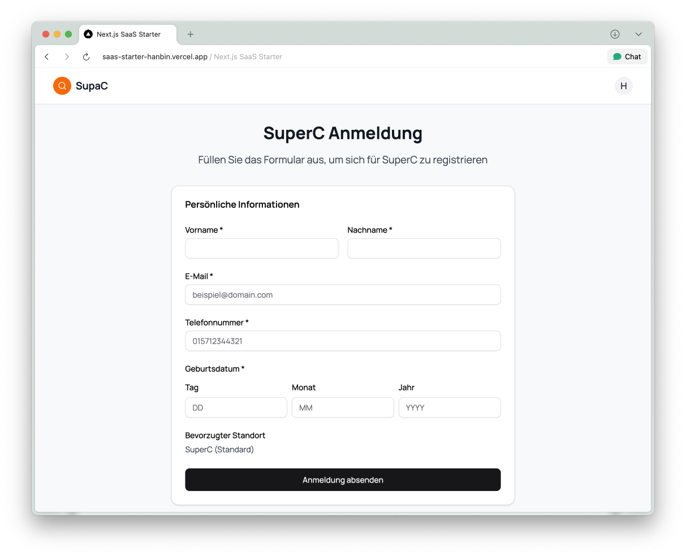
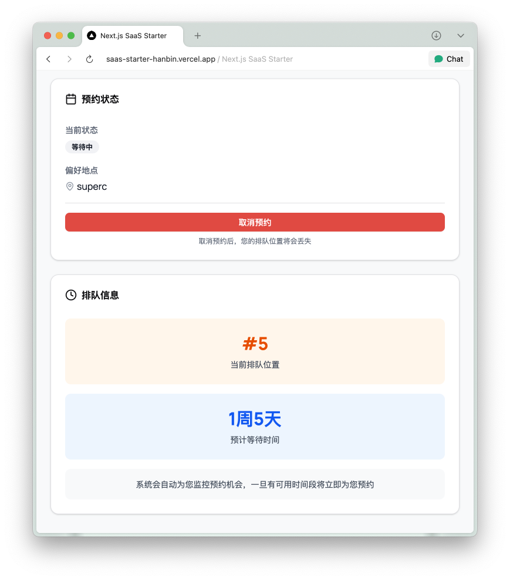

## SupaC Main Page

## SupaC Registeration Page

## SupaC Info Page

- Info page (`/info`) with animated Terminal element

## 项目概述 / Project Overview

 Independently developed SaaS platform for automated appointment booking: serving over 200 active users
- Full-stack architecture: Next.js frontend, Python backend with PostgreSQL database integration
- Optimization result: 80\% waiting time reduction (from 1-2 weeks to 1-2 days)
- Business integration: PayPal payment system for seamless transaction processing
- Technologies: React, Next.js, Python, PostgreSQL, PayPal API, LLMs, CI/CD, Docker, Cloud
- Architecture: web front，restful api backend, mirco service，database
- cloud-based deployment mit CI/CD pipeline
