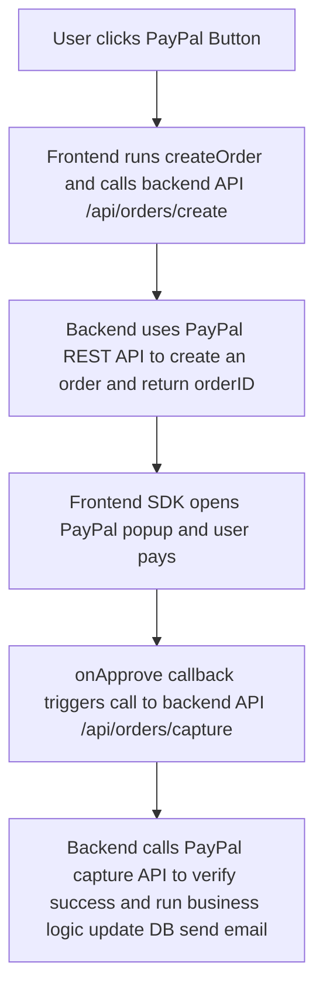

# PayPal Integration Flow

chart

```mermaid

flowchart TD
    A[User clicks PayPal Button] --> B[Frontend runs createOrder and calls backend API /api/orders/create]
    B --> C[Backend uses PayPal REST API to create an order and return orderID]
    C --> D[Frontend SDK opens PayPal popup and user pays]
    D --> E[onApprove callback triggers call to backend API /api/orders/capture]
    E --> F[Backend calls PayPal capture API to verify success and run business logic update DB send email]
```
