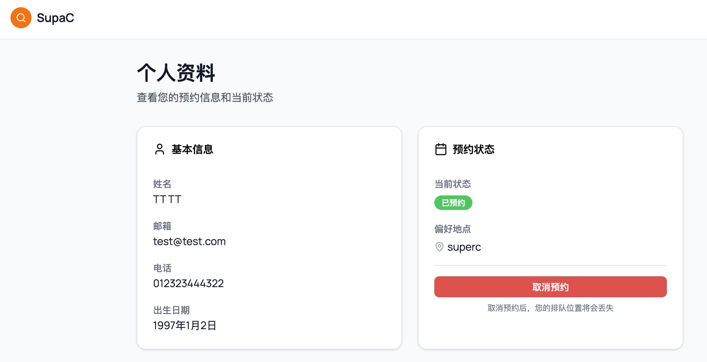
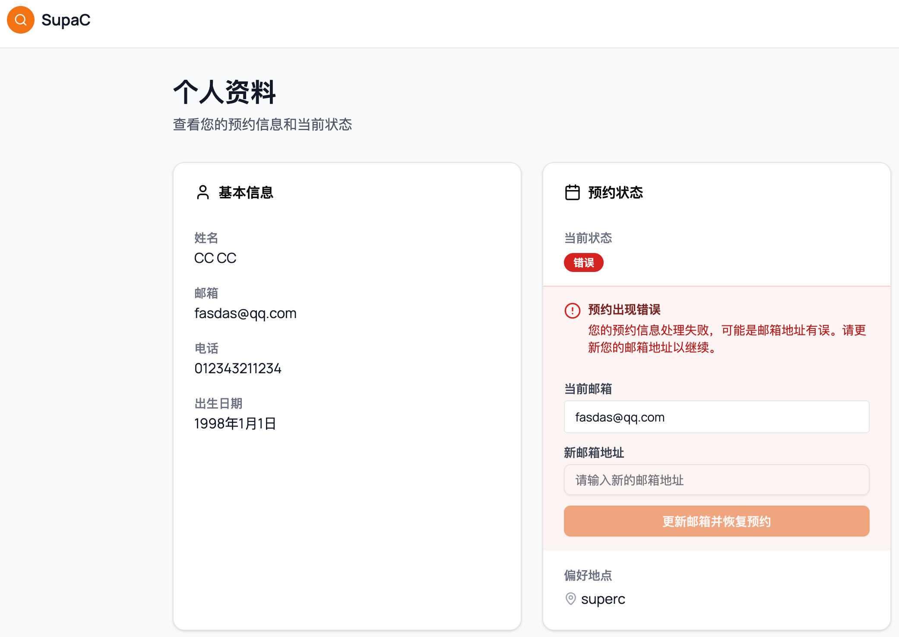

# SuperC Profile Page Specification

## Overview
SuperC 个人资料页面，展示不同的状况：
- 用户的预约信息
- 未找到预约信息时的提示
- 当前状态和排队信息
- 可能的错误状态

提供预约管理功能，包括查看预约状态、取消预约操作和邮箱更新功能。

## File Structure
```
profile/
├── page.tsx        # 个人资料展示页面
├── actions.ts      # Server Actions（邮箱更新等）
└── spec.md         # 本规格说明文件
```

## Page Layout

### `/page.tsx` - 个人资料页面
- **组件**: `ProfilePage`
- **功能**: 显示用户预约档案和状态管理

### 页面结构
- **Loading State**: 加载动画
- **No Profile State**: 未找到预约信息提示
- **Header**: SuperCHeader 导航组件
- **Main Content**: 
  - 页面标题
  - 成功/错误消息显示
  - 基本信息卡片
  - 排队信息卡片 / 错误状态处理 / 成功预约信息

#### Booked State


#### waiting State


#### Error State


## Components Used

### UI Components
- **Card, CardContent, CardHeader, CardTitle**: 卡片布局组件
- **Badge**: 状态标签组件
- **Button**: 按钮组件
- **Input**: 输入框组件
- **SuperCHeader**: 页面头部组件

### Icons
- **CalendarIcon, ClockIcon, MapPinIcon, UserIcon, AlertCircle**: Lucide React 图标

## Hooks & APIs

### React Hooks
- **useState**: 管理组件状态
  - profile: 用户预约档案数据
  - queueInfo: 排队信息
  - loading: 加载状态
  - cancelling: 取消预约加载状态
  - message: 操作结果消息
  - newEmail: 新邮箱地址输入
  - updatingEmail: 更新邮箱加载状态
- **useEffect**: 页面加载时获取数据

### API Integration
- **GET /api/superc/profile**: 获取用户预约档案和排队信息
- **cancelAppointment**: Server Action，取消用户预约
- **updateProfileEmail**: Server Action，更新用户邮箱地址


## Page States

### Loading State
- 显示骨架屏加载动画
- SuperCHeader + 灰色占位块

### No Profile State
- 显示"未找到预约信息"提示
- 引导用户创建预约档案
- 跳转到 `/superc/main` 的链接

### Profile Display
- 基本信息卡片：显示姓名、邮箱、电话、出生日期
- 预约状态卡片：显示当前状态、偏好地点、预约时间
- 取消预约按钮（状态为 waiting 或 booked 时）

### Queue Information
- 当前排队位置（橙色背景）
- 预计等待时间（蓝色背景）
- 系统监控说明

## Technical Details

### Data Fetching
- 页面加载时调用 `/api/superc/profile` 获取数据
- 异步加载，try-catch 错误处理

### Status Badge Logic
- **waiting**: 等待中（secondary badge）
- **booked**: 已预约（绿色 badge）
- **error**: 错误状态（destructive badge）
- **default**: 未知状态（outline badge）

### Cancel Appointment Flow
1. 确认对话框提示用户
2. 设置加载状态
3. 调用 cancelAppointment Server Action
4. 处理结果并显示消息
5. 成功后2秒刷新页面

### Update Email Flow (Error Status Only)
1. 检查当前状态是否为 error
2. 用户输入新邮箱地址
3. 验证邮箱格式
4. 调用 updateProfileEmail Server Action
5. 更新邮箱并将状态改为 waiting
6. 显示成功消息并刷新页面

### Date Formatting
- **formatBirthDate**: 格式化出生日期为中文显示
- **toLocaleString**: 预约时间本地化显示

## Dependencies
- `@/app/components/ui/*` - UI 组件库
- `lucide-react` - 图标库
- `@/app/lib/db/schema` - 数据类型
- `../main/actions` - Server Actions（取消预约）
- `./actions` - 本地 Server Actions（邮箱更新）

## Error Handling & Special States

### Error Status Handling
当用户预约状态为 `error` 时：
- 显示特殊的错误状态界面
- 提供邮箱更新功能
- 显示当前邮箱和新邮箱输入框
- 允许用户更新邮箱以恢复预约状态

### Email Update Validation
- 使用 Zod schema 验证邮箱格式
- 只允许在错误状态下更新邮箱
- 更新成功后自动将状态改为 waiting
- 提供用户友好的错误消息

### Message System
- 统一的消息显示组件
- 支持 success 和 error 两种类型
- 绿色背景显示成功消息
- 红色背景显示错误消息
- 自动刷新页面以更新数据